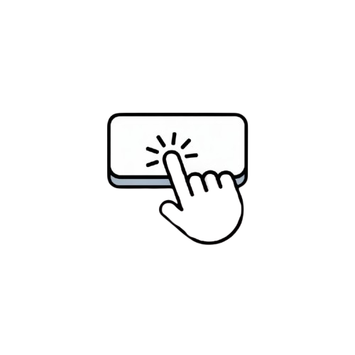
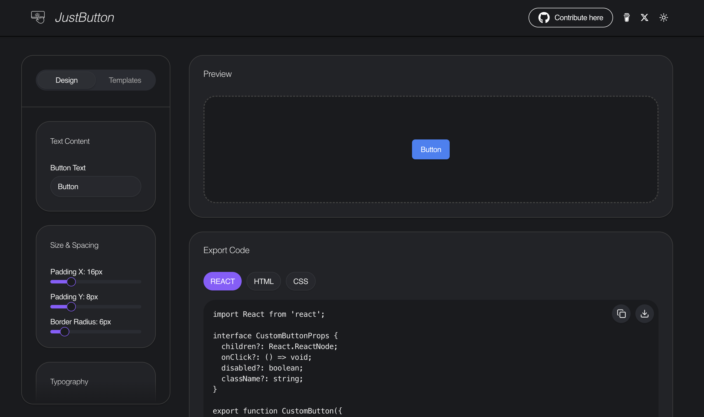

# JustButton



A beautiful, open-source button customizer and code generator for React and the web. Instantly design, preview, and export production-ready button components with live customization, templates, and one-click code export.

[](https://opensource.org/licenses/MIT)

---

## 🚀 Demo

Try it live: [JustButton Demo](https://justbutton.space)

---

## ✨ Features

- 🎨 **Visual Button Customizer:** Instantly tweak text, colors, gradients, size, padding, border, radius, shadow, hover effects, and more.
- 🧩 **Templates:** Start from beautiful, ready-made button templates or save your own.
- 🔄 **Live Preview:** See your changes in real time.
- 💻 **Code Export:** Export your button as React, HTML, or CSS code with a single click.
- 🌗 **Dark/Light Theme:** Seamless theme switching.
- 🔗 **Open Source:** MIT licensed and ready for contributions.

---

## 🖥️ Screenshots



---

## 🛠️ Tech Stack

- **Framework:** [Next.js](https://nextjs.org/) (App Router, React 19)
- **Styling:** [Tailwind CSS](https://tailwindcss.com/), [Radix UI](https://www.radix-ui.com/)
- **Icons:** [Lucide](https://lucide.dev/), [react-icons](https://react-icons.github.io/react-icons/)
- **TypeScript**

---

## 📦 Installation

Clone the repository and install dependencies:

```bash
git clone https://github.com/rudra016/justbutton.git
cd justbutton
npm install
```

---

## 🏃‍♂️ Usage

Start the development server:

```bash
npm run dev
```

Open [http://localhost:3000](http://localhost:3000) in your browser.

---

## 🧑‍💻 Contributing

Contributions are welcome! Please open issues or pull requests for features, fixes, or ideas.

1. Fork the repository
2. Create your feature branch (`git checkout -b feature/my-feature`)
3. Commit your changes (`git commit -am 'Add new feature'`)
4. Push to the branch (`git push origin feature/my-feature`)
5. Open a Pull Request

---

## 📄 License

This project is open source under the MIT License. See [LICENSE](LICENSE) for details.

---

## 🙏 Credits

- [Next.js](https://nextjs.org/)
- [Tailwind CSS](https://tailwindcss.com/)
- [Radix UI](https://www.radix-ui.com/)
- [Lucide Icons](https://lucide.dev/)
- [react-icons](https://react-icons.github.io/react-icons/)

---

## 🌟 Author

Built with ❤️ by [Rudra Kumar](https://github.com/rudra016)

---

## 📬 Contact

- Twitter: [@sudo_rudra](https://x.com/sudo_rudra)
- GitHub: [rudra016/justbutton](https://github.com/rudra016/justbutton)
- Buy Me a Coffee: [coff.ee/rudra016](https://coff.ee/rudra016)

---

> _Empower your UI. JustButton it!_
